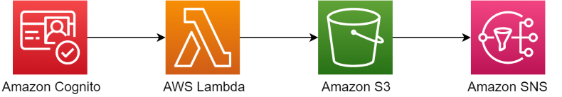

# New User Service

This repository contains a microservice that uses Amazon Cognito to manage the registration process, then stores the user information in S3. An event is created using a confirmation trigger and sent to SNS with the user information payload. This topic can be subscribed to by other services.

It also provides a pipeline for staging and prodution environments using the AWS CDK.

This is a simple stand-alone service that can be used as part of a larger application framework. It contains its own datastore, and supplies the data in a publish-subscribe pattern. By copying the payload from Cognito to S3, we have access to the full-user data for other services while still allow Cognito to manage the users.

## Architecture



## Requirements

* An AWS account
* Node.js 12 or above
* npm 6 or above
* [AWS SAM CLI 0.40.0](https://docs.aws.amazon.com/serverless-application-model/latest/developerguide/serverless-sam-cli-install.html)

## Instructions

### CI/CD

```sh
Source -> Build -> Test -> Deploy to Staging -> Deploy to Production (Manual approval + Deploy)
```

Stages and actions are implemented using AWS CodePipeline, AWS CodeBuild and AWS CodeDeploy (behind the scenes through `sam deploy` command).

Pipeline itself is defined and provisioned by [AWS CDK](https://docs.aws.amazon.com/cdk/latest/guide/home.html) using Typescript.

1. Run the pipeline using AWS CDK to deploy the CI/CD pipeline first. 

* First, install AWS CDK tools:

  ```sh
  npm install -g aws-cdk
  ```

* Then, fetch dependencies and provision pipeline:

  ```sh
  cd pipeline
  npm install
  npm run build
  cdk deploy
  ```
If you have permission issues on deploy try overriding configuration and/or supplying a profile, depending on your setup:

```sh
cdk deploy --require-approval never --profile your-aws-profile
```

### SAM

1. CDK deploy will have created a new empty repository. Get the SSH or HTTPS url from CodeCommit and add it to git.

```sh
git remote add origin
```
2. Push the local repo to CodeCommit. The new code will trigger the pipeline and it will create all the resources defined in template.yaml

```sh
git push origin master
```
After the pipeline has run there will be a new Cognito user pool created. There is no front-end included in this service so testing has to be done with scripts or a proprietary front-end.

## Notes
* This project has borrowed heavily from https://github.com/aws-samples/aws-serverless-app-sam-cdk/ . Take a look at that repository for more information.

* The E2E tests are not working right now. This is because AWS does not have a native way of testing S3 (that I'm aware of) and there were many issues trying Localstack to solve the problem. Hopefully in the near future this will be solved.

* This project is part of a larger application currently in development. Expect changes as things progress.

* When deleting the stack it is neccesary to empty and delete 2 S3 buckets as well

## License
This library is licensed under the MIT License. See the LICENSE file.